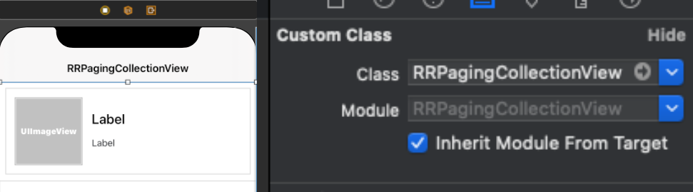

# RRPagingCollectionView
[](https://github.com/Rahul-Mayani/RRPagingCollectionView/blob/master/LICENSE)
[](https://github.com/Rahul-Mayani/RRPagingCollectionView/tree/master/RRPagingCollectionView/PagingCollectionView)
[](https://developer.apple.com/swift/)

The simplest way to add paginate function to your collection view.  
All you have to do is just set your collection view class in the storyboard to `RRPagingCollectionView`, and implement the `PagingCollectionViewDelegate#paginate`

## Example


## Requirements

pod 'RxCocoa'

pod 'RxSwift'

pod 'RxGesture'

pod 'Kingfisher'

## Installation

#### Manually
1. Download the project.
2. Add `RRPagingCollectionView.swift`, `RRPagingCollectionViewDelegate.swift` & `RRLoadingFooter.swift` with necessary files in your project.
3. Congratulations!  

## Usage example

First set your collection view class in the storyboard to `RRPagingCollectionView`



Then implement `paginate` function. If `isLoading` is set to true, an indicator is displayed at the bottom of the collection view. Otherwise, the indicator disappears and `UICollectionView.reloadData` is called.

```swift

//Create RRPagingCollectionView class CollectionView outlet and set storyboard file itself
@IBOutlet weak var collectionView: RRPagingCollectionView!

//set pagingDelegate in viewDidLoad method
collectionView.pagingDelegate = self

//Start paging animation while data load from server
// MARK: - PagingCollectionViewDelegate -
func paginateCtn(_ collectionView: RRPagingCollectionView, to page: Int) {
    if !collectionView.isLoading && totalDataCount > dataArray.count {
        collectionView.isLoading = true
        //API call for getting new data
    }
}

//Set loading CollectionView Loading Footer view
func collectionView(_ collectionView: UICollectionView, viewForSupplementaryElementOfKind kind: String, at indexPath: IndexPath) -> UICollectionReusableView {
    return collectionView.collectionView(collectionView, viewForSupplementaryElementOfKind: kind, at: indexPath)
}

func collectionView(_ collectionView: UICollectionView, layout collectionViewLayout: UICollectionViewLayout, referenceSizeForHeaderInSection section: Int) -> CGSize {
    return collectionView.collectionView(collectionView, layout: collectionViewLayout, referenceSizeForHeaderInSection: section)
}

func collectionView(_ collectionView: UICollectionView, layout collectionViewLayout: UICollectionViewLayout, referenceSizeForFooterInSection section: Int) -> CGSize {
    return collectionView.collectionView(collectionView, layout: collectionViewLayout, referenceSizeForFooterInSection: section)
}

//Stop paging animation after get API response
collectionView.reloadData()
collectionView.isLoading = false

```
To run the example project, clone the repo, and run pod install from the Example directory first.

## APIs

| Name | Type | Description |
|---|---|---|
| `pagingDelegate` | `PagingCollectionViewDelegate` | Delegate pagination processing |
| `currentPage` | `Int` | Returns the current page |
| `isLoading` | `Bool` | Shows and hides the loading indicator. Reload collection view data after loading |
| `reset()` | `Void` | Return page to 0 and call `paginate` function |

## Contribute 

We would love you for the contribution to **RRPagingCollectionView**, check the ``LICENSE`` file for more info.


## License

[RRPagingCollectionView](https://github.com/Rahul-Mayani/RRPagingCollectionView/tree/master/RRPagingCollectionView/PagingCollectionView) is available under the MIT license. See the [LICENSE](https://github.com/Rahul-Mayani/RRPagingCollectionView/blob/master/LICENSE) file for more info.
